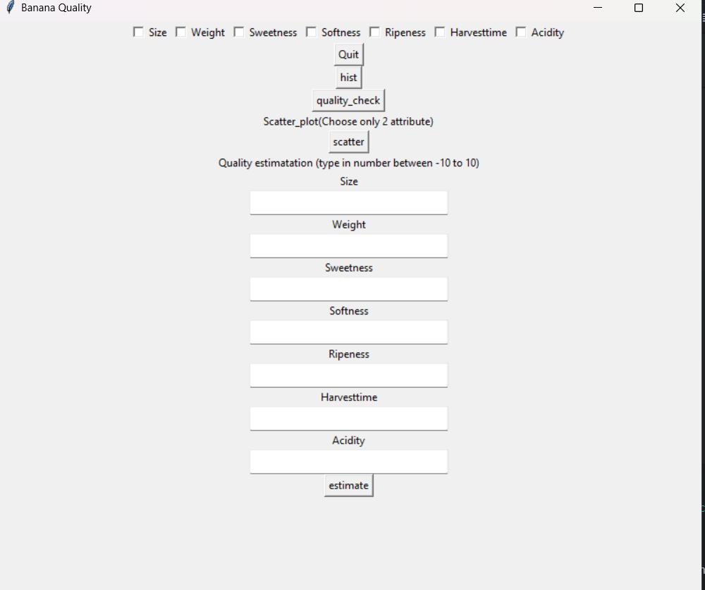
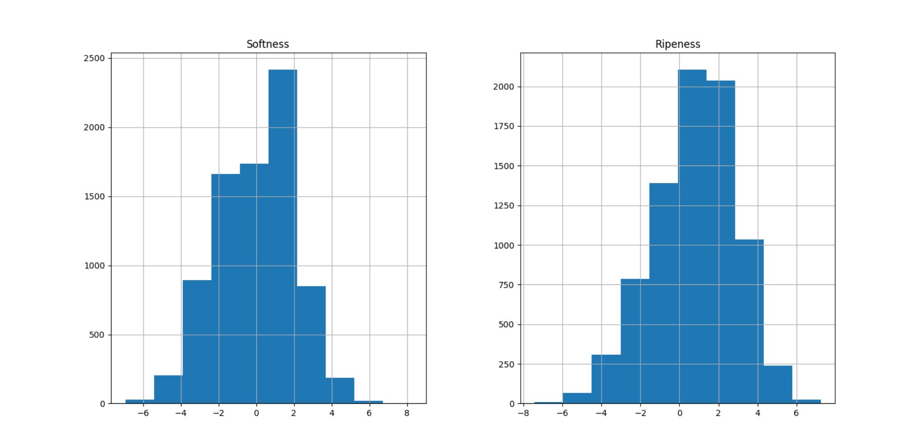
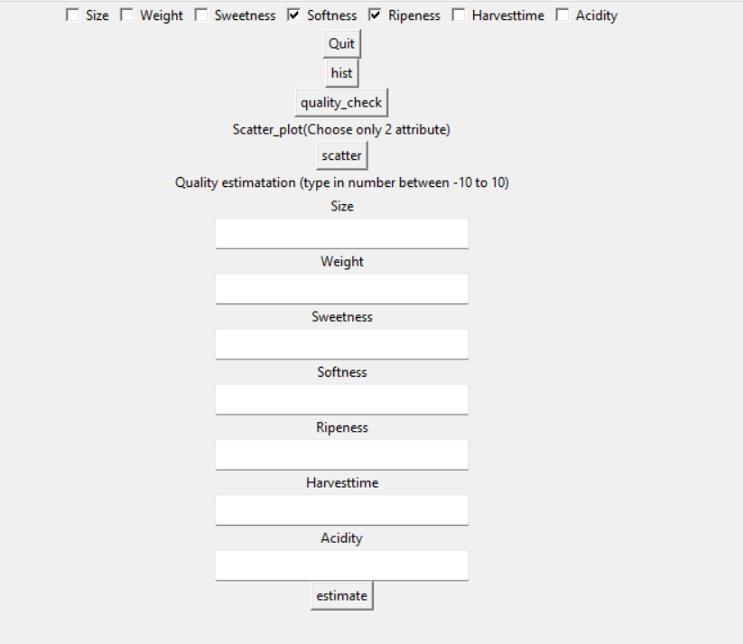
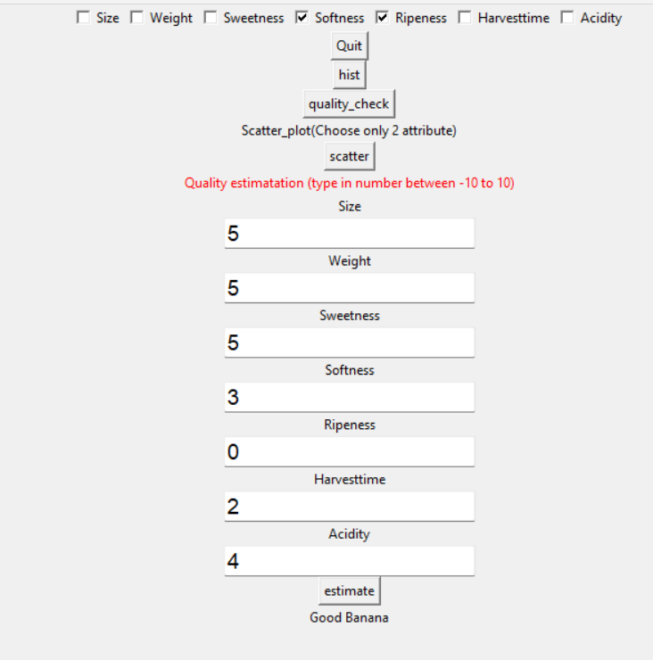
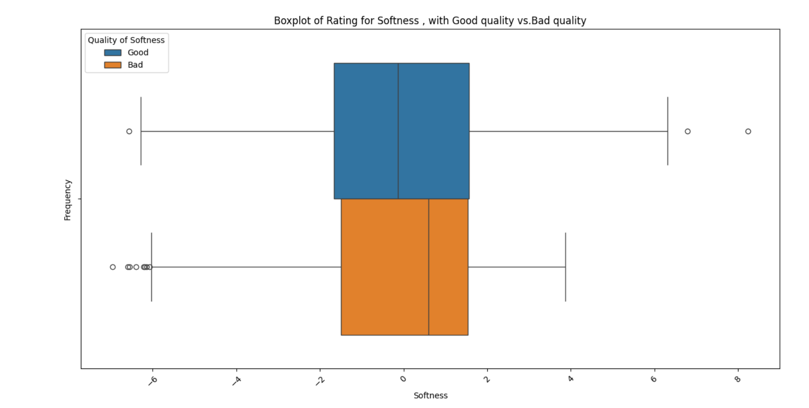
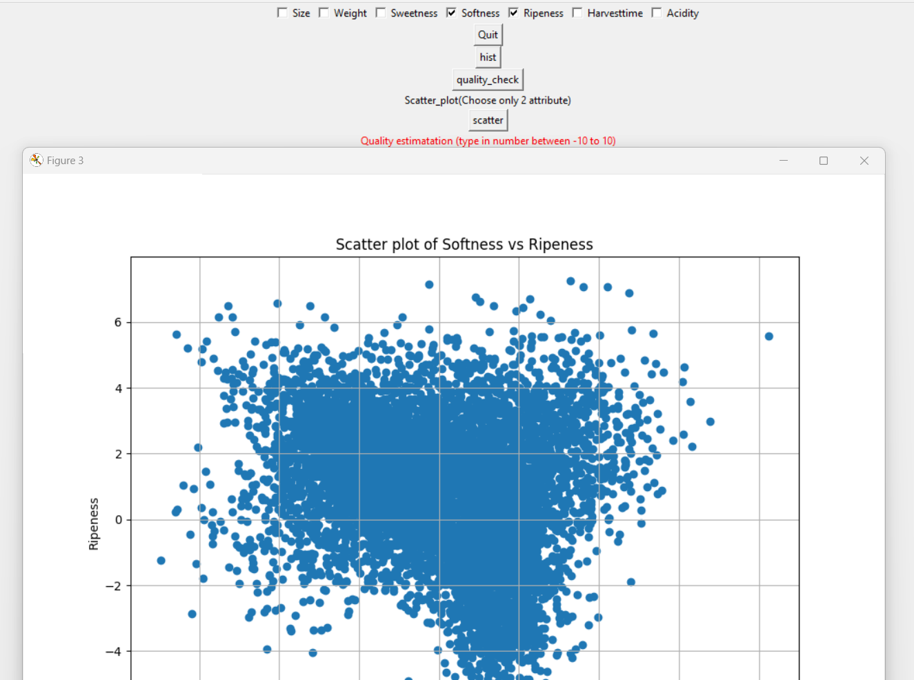
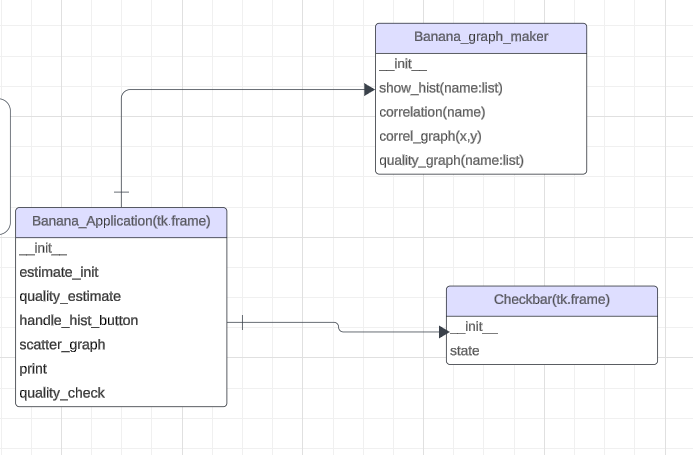
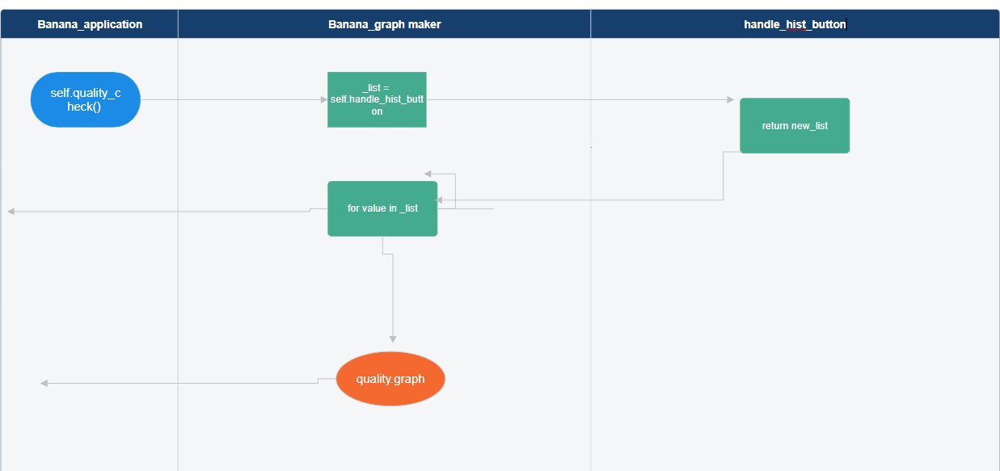

# Banana_Quality_project
Banana Quality Estimate
This application offers a comprehensive analysis of banana quality attributes through intuitive visualizations and data comparisons. By visualizing the frequency of each attribute and contrasting good and bad data sets, it provides a clear understanding of how individual attributes influence banana quality. Additionally, the application conducts correlation analyses to identify the most significant factors affecting quality. Moreover, it goes a step further by incorporating a predictive feature, allowing users to estimate the quality of a banana based on basic input parameters such as color, size, and sweetness. With its user-friendly interface and insightful analyses.

# Description
This code use checkbox for all of the attribute choosing by choosing attribute you interested then click the button dow to visualize
and the estiamte method by typing number down in entry box then procede to click estimate it will estimate quality of that banana

# How to run and install
First clone the git repository
git clone https://github.com/Glassesdwarf/Banana_Quality_project.git
then cd to folder
cd Banana_Quality_project
3.Installing requirement.txt
pip install -r requirements.txt
4.Run the program
python banana_screen.py
# Project_document
Project proposal 
https://docs.google.com/document/d/18GdzARkAQcWvLPu2I0t88iS7b55dwN2tK8aOmWZft3M/edit#heading=h.brkgjcw3i7fl
UML diagram

# Data source
https://www.kaggle.com/datasets/l3llff/banana

